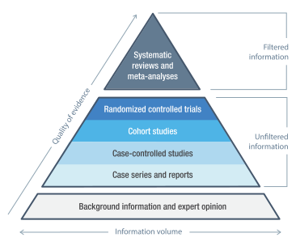
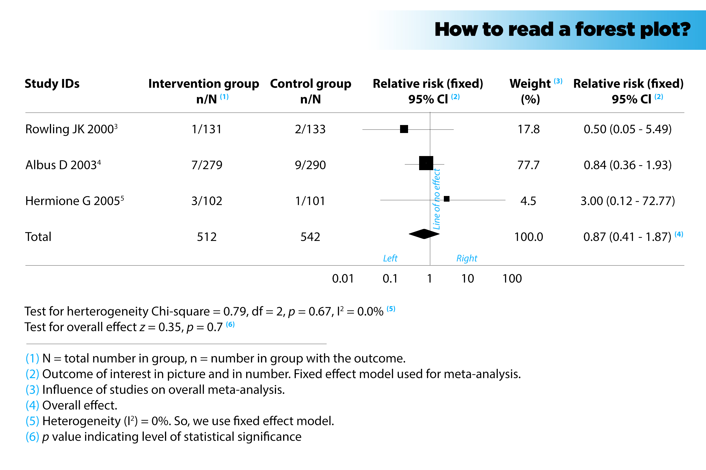
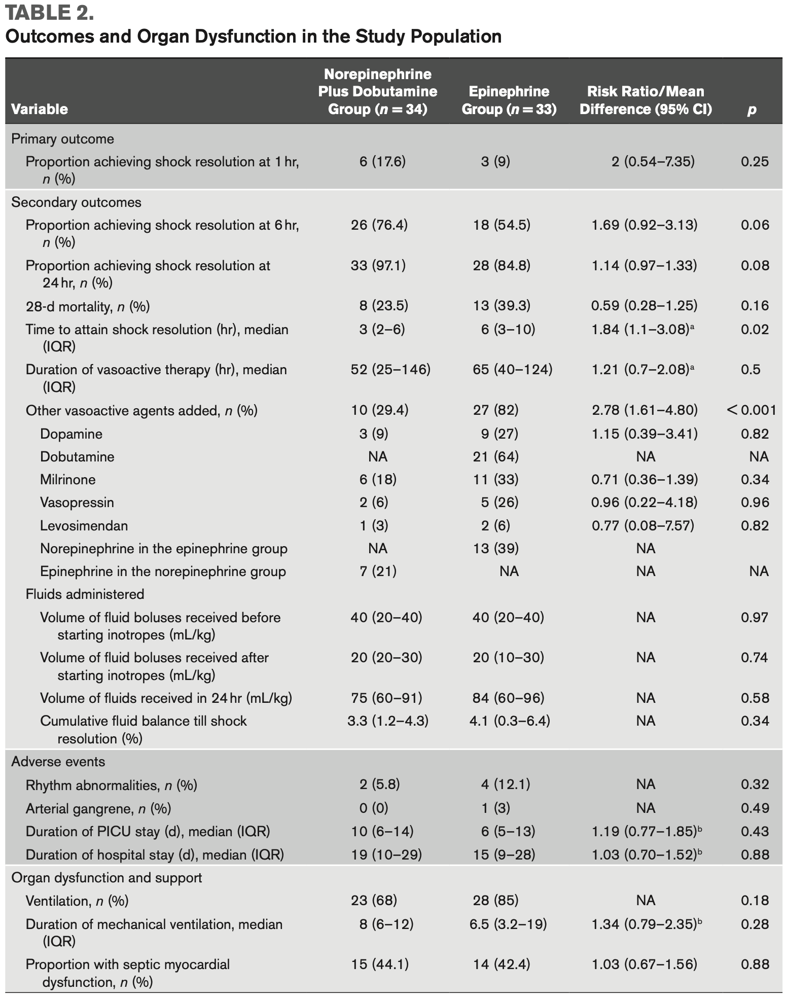

```{r setup, include=FALSE}
knitr::opts_chunk$set(echo = FALSE, warning = FALSE, message = FALSE)
library(ggplot2)
library(metafor)
library(dplyr)
library(tidyr)
library(xaringanthemer)

style_mono_accent(base_font_size = '16px')
```

class: middle

# Agenda

1. Discuss some basic statistical things
<br><br>
2. Gain an intuition about systematic reviews and meta-analyses
<br><br>
3. Understand their strengths and shortcomings
<br><br>
4. Review relevant measures and tests

---

class: middle, center

# Basic Statistical Things

---

class: middle, center

# Reminder of Accuracy v. Precision


---

class: middle

# There are some important random terms

<html>
--

- **Generalizability**
- How applicable is a finding from a particular sample to the population
--
<br><br>
- **P-value**
- Probability of finding a value this extreme by random chance (given the assumption of a true null)
--
<br><br>
- **Confidence Interval**
- Interval over which population (true?) value is expected to be found with a specified probability (e.g. 95%)
--
<br><br>
- **Efficacy**
- Performance of treatment under ideal circumstances
--
<br><br>
- **Effectiveness**
- Performance of treatment under real world circumstances

---

class: middle

# Hypothesis Testing

- $H_0$: There is **no** difference in the groups or no slope in regression **(these are the same thing, fyi)**

- $H_A$: There is difference because the probability of $H_0$ being true randomly is low **(you define how low)**

---

class: middle, center

# Was on my boards for both Peds and IM

.pull-right[.left[**Which of the following is the best method to assess the association between OCP use and blood clots?**<br>A. Two sample T-test<br>B. Analysis of variance<br>C. Pearson correlation<br>D. Chi-square test<br>E. Spearman correlation<br>]]

```{r, results='asis'}
cat('
<table style="margin-left:6%;">
<tr><th align="left"></th><th align="right">Clot</th><th align="right">No Clot</th><th align="right">Total</th></tr>
<tr><td align="left">OCP Use</td><td align="right">500</td><td align="right">400</td><td align="right">900</td></tr>
<tr><td align="left">No OCP Use</td><td align="right">80</td><td align="right">20</td><td align="right">100</td></tr>
<tr><td align="left">Total</td><td align="right">580</td><td align="right">420</td><td align="right">1000</td></tr>
</table>
')
```

.pull-left[Table 1: Counts of OCP use and blood clots]

---

class: middle, center

# Was on my boards for both Peds and IM

.pull-right[.left[**Which of the following is the best method to assess the association between OCP use and blood clots?**<br>A. Two sample T-test<br>B. Analysis of variance<br>C. Pearson correlation<br>D. _**Chi-square test**_<br>E. Spearman correlation<br>]]

```{r, results='asis'}
cat('
<table style="margin-left:6%;">
<tr><th align="left"></th><th align="right">Clot</th><th align="right">No Clot</th><th align="right">Total</th></tr>
<tr><td align="left">OCP Use</td><td align="right">500</td><td align="right">400</td><td align="right">900</td></tr>
<tr><td align="left">No OCP Use</td><td align="right">80</td><td align="right">20</td><td align="right">100</td></tr>
<tr><td align="left">Total</td><td align="right">580</td><td align="right">420</td><td align="right">1000</td></tr>
</table>
')
```

.pull-left[Table 1: Counts of OCP use and blood clots]

---

class: middle, center

# Why?

The data are counts.

---

class: middle

# Data type goes with hypothesis test

- **Counts of 2 or more groups:** Chi-square, Fisher exact (only 2x2 contingency)
<br><br>
- **Quantitative variable + grouping variable(s):** T-test (data approximates a t-distribution), U-test (distribution not well defined), ANOVA
<br><br>
- **Quantitative variable + ranking variable:** Spearman correlation
<br><br>
- **Quantitative and 2 variables:** Pearson correlation

---

class: middle

# Hypothesis testing: 4 possible outcomes

.pull-left[]

.pull-right[
- Correct - Reject a false $H_0$
  - Probability of success is called "power"
  - Power depends on sample size
  - bigger sample = bigger power

- Correct - Fail to reject a true $H_0$
  - Probability determined by $\alpha$ as $1−\alpha$

- Type 1 - Incorrect rejection of a true $H_0$
  - False Positive

- Type 2 - Failure to reject a false $H_0$
  - False Negative]

---

class: middle, center

# Things that destroy external validity

---

class: middle, center

# Types of Biases - My groupings

---

class: middle

## Biases of design or unseen variables

- Selection bias
  - Non-random partitioning of individuals into groups
- Observer-expectancy
  - Observer is unblinded and expects a particular outcome
- Effect modification
  - Magnitude of effect varies by third variable
- Confounding
  - Unseen third variable is an underlying cause for correlation of two other variables

---

class: middle

## Biases of information (measurement)

- Recall bias
  - Subjects with disease can recall exposures better than healthy subjects

<br>
- Procedure bias
  - Experimenters vary systematically in the way they do work
  - e.g. Experimenters don't follow the specified procedure

<br>
- Instrument bias
  - Instrument is broken
  - Instruments can also be things like surveys
  - Just means instrument is not reliable

---

class: middle

## Biases of time and completion

- Lead-time bias
  - New test detects disease earlier
  - Survival appears improved with new test

<br>
- Attrition bias
  - Subjects systematically withdraw
  - Could be things like side effects or lack of improvement

<br>
- Loss-to-follow up
  - Subjects randomly do not report for scheduled followup

---

class: middle, center

# For each of these biases, there is a possible fix

---

class: middle

# Available corrections (much easier prospectively)

- Selection bias - **randomization**
- Observer-expectancy - **blinding**
- Effect modification - **stratification**
- Confounding - **randomization or propensity scoring** (hard to fully eliminate)
<br>
- Recall bias - **prospective**
- Procedure bias - **standardization or crossover**
- Instrument bias (not just hard tools) - **depends on type of instrument**
<br>
- Lead-time bias - **using time from randomization rather than diagnosis**
- Attrition bias - **intent to treat**
- Loss-to-follow up - **intent to treat**

---

class: middle, center

# Foundation of 'Evidence-Based Medicine'

---

class: middle, center

# The same image we always see repeated



---

class: middle

**Two things to keep in mind:**

1. Medical school emphasizes the physiological-model-as-evidence for medicine which is the lowest part of the pyramid
<br><br>
2. `#`1 occurs because randomized trials and their derivatives (meta-analyses) are *extremely* inefficient means of knowledge generation

---

class: middle, center

# Systematic Reviews 

---

class: middle

# What is a Systematic Review?

1. Rigorous and structured approach to reviewing available literature on a specific topic.

---

class: middle, incremental

# Conducting a Systematic Review

<html>
--
1. Define the research question.<br>
--
2. Develop a protocol for identifying and including/excluding studies.<br>
--
3. Conduct a literature search.<br>
--
4. Screen and select studies.<br>
--
5. Extract and synthesize data.<br>
--
6. Assess the quality of the evidence.<br>

---

class: middle, center

# Meta-Analyses 

---

class: middle

# What is a Meta-Analysis?

- Statistical technique that combines results from multiple studies.
- Generally used within a systematic review.

---

class: middle

# Pros of Systematic Review

1. **Reduces bias** - Follow a rigorous and predefined method, reducing the potential for bias in the identification, selection, and appraisal of studies.
<br><br>
2. **Completeness** - Synthesize many studies to one result - With meta-analysis can generate combined (pooled) estimates and errors
<br><br>
3. **Identify Gaps** - Can reveal areas where research is lacking or not of high quality, providing direction for future research

---

class: middle

# Cons of Systematic Review

1. **Extraordinarily Resource Intensive** - Take an incredible amount of prior work to achieve useful conclusions
<br><br>
2. **Can Be Difficult to Interpret** - Publication bias and study heterogeneity can make it difficult to synthesize a result. 
<br><br>
3. **Lag Time** - Due to #1, it take a lot of time to get an answer and sometimes the field is settled before the review is written

---

class: middle

# All reviews are not systematic reviews

- A standard review is a narrative review and it is quite different

---

class: middle, center

# Common Statistical Methods 

---

class: middle

# Key Statistical Methods and Evaluating Meta-analysis

1. Odds Ratio (OR)
2. Risk Ratio (RR)
3. Risk Difference (RD)
4. Number Needed to Treat (NNT)
5. Heterogeneity (I2)
6. Publication Bias (Funnel plots, Egger's test)

---

class: middle, center

# Here is some data

```{r some-data, out.width = '50%', fig.asp = 1, dpi = 300}
# Example data
dat <- data.frame(Group = factor(c("Exposed", "Non-Exposed"), levels = c("Exposed", "Non-Exposed")),
                  Disease = c(30, 20),
                  No_Disease = c(70, 80)) 

tdat <- dat %>%
  pivot_longer(c(Disease, No_Disease))

# Plot
odds_ratio_plot <- ggplot(tdat, aes(x = Group, y = value, fill = name)) +
  geom_bar(stat = "identity", position = position_stack(reverse = TRUE)) +
  scale_fill_manual(values = c(Disease = "red", No_Disease = "blue"), name = "") +
  xlab('exposure status') +
  ylab('count') + 
  theme_minimal(20) +
  theme(legend.position="topright")

odds_ratio_plot
```

---

class: middle, center

# Here is the same data

```{r, results='asis'}
cat('
<table>
<tr><th align="left"></th><th align="right">Disease</th><th align="right">No Disease</th><th align="right">Total</th></tr>
<tr><td align="left">Exposed</td><td align="right">30</td><td align="right">70</td><td align="right">100</td></tr>
<tr><td align="left">Not Exposed</td><td align="right">20</td><td align="right">80</td><td align="right">100</td></tr>
<tr><td align="left">Total</td><td align="right">50</td><td align="right">150</td><td align="right">200</td></tr>
</table>
')
```

---

class: middle, center

# Odds Ratio (OR)

```{r odds-ratio}
OR <- (dat$Disease[1] / dat$No_Disease[1]) / (dat$Disease[2] / dat$No_Disease[2])
```

.pull-left[
```{r, results='asis'}
cat('
<table>
<tr><th align="left"></th><th align="right">Disease</th><th align="right">No Disease</th><th align="right">Total</th></tr>
<tr><td align="left">Exposed</td><td align="right">30</td><td align="right">70</td><td align="right">100</td></tr>
<tr><td align="left">Not Exposed</td><td align="right">20</td><td align="right">80</td><td align="right">100</td></tr>
<tr><td align="left">Total</td><td align="right">50</td><td align="right">150</td><td align="right">200</td></tr>
</table>
')
```
]

.pull-right[
.left[
$OR = \frac{D_E * ND_{NE}}{D_{NE} * ND_E} = \frac{30 * 80}{20 * 70} =$ **`r round(OR, 2)`**
]
]

---

class: middle, center

# Risk Ratio (RR)
**Only use on random samples**

```{r risk-ratio, fig.height=4, fig.width=6}
# Example data
dat$Total <- dat$Disease + dat$No_Disease

# Calculate Risk Ratio
RR <- (dat$Disease[1] / dat$Total[1]) / (dat$Disease[2] / dat$Total[2])
```

.pull-left[
```{r, results='asis'}
cat('
<table>
<tr><th align="left"></th><th align="right">Disease</th><th align="right">No Disease</th><th align="right">Total</th></tr>
<tr><td align="left">Exposed</td><td align="right">30</td><td align="right">70</td><td align="right">100</td></tr>
<tr><td align="left">Not Exposed</td><td align="right">20</td><td align="right">80</td><td align="right">100</td></tr>
<tr><td align="left">Total</td><td align="right">50</td><td align="right">150</td><td align="right">200</td></tr>
</table>
')
```
]

.pull-right[
.left[
$R_E = \frac{D_E}{D_E + ND_E} = \frac{30}{30 + 70} = 0.3$<br><br>
$R_{NE} = \frac{D_{NE}}{D_{NE} + ND_{NE}} = \frac{20}{20 + 80} = 0.2$<br><br>
$RR = \frac{R_E}{R_{NE}} = \frac{0.3}{0.2} =$ **`r RR`**
]
]

---

class: middle, center

# Risk Difference (RD)

```{r risk-difference, fig.height=4, fig.width=6}
# Calculate Risk Difference
RD <- (dat$Disease[1] / dat$Total[1]) - (dat$Disease[2] / dat$Total[2])
```

.pull-left[
```{r, results='asis'}
cat('
<table>
<tr><th align="left"></th><th align="right">Disease</th><th align="right">No Disease</th><th align="right">Total</th></tr>
<tr><td align="left">Exposed</td><td align="right">30</td><td align="right">70</td><td align="right">100</td></tr>
<tr><td align="left">Not Exposed</td><td align="right">20</td><td align="right">80</td><td align="right">100</td></tr>
<tr><td align="left">Total</td><td align="right">50</td><td align="right">150</td><td align="right">200</td></tr>
</table>
')
```
]

.pull-right[
.left[
$R_E = \frac{D_E}{D_E + ND_E} = \frac{30}{30 + 70} = 0.3$<br><br>
$R_{NE} = \frac{D_{NE}}{D_{NE} + ND_{NE}} = \frac{20}{20 + 80} = 0.2$<br><br>
$RD = R_E - R_{NE} = 0.3 - 0.2 =$ **`r RD`**
]
]

---

class: middle, center

# Number Needed to Harm or Treat<br>(NNH or NNT)

```{r nnt, fig.height=4, fig.width=6}
# Calculate Number Needed to Treat
NNT <- 1 / abs(RD)
```

.pull-left[
<br>
```{r, results='asis'}
cat('
<table>
<tr><th align="left"></th><th align="right">Disease</th><th align="right">No Disease</th><th align="right">Total</th></tr>
<tr><td align="left">Exposed</td><td align="right">30</td><td align="right">70</td><td align="right">100</td></tr>
<tr><td align="left">Not Exposed</td><td align="right">20</td><td align="right">80</td><td align="right">100</td></tr>
<tr><td align="left">Total</td><td align="right">50</td><td align="right">150</td><td align="right">200</td></tr>
</table>
')
```
]

.pull-right[
.left[
$R_E = \frac{D_E}{D_E + ND_E} = \frac{30}{30 + 70} = 0.3$<br><br>
$R_{NE} = \frac{D_{NE}}{D_{NE} + ND_{NE}} = \frac{20}{20 + 80} = 0.2$<br><br>
$RD = R_E - R_{NE} = 0.3 - 0.2 = 0.1$<br><br>
$NNH = \frac{1}{0.1} =$ **`r NNT`**
]
]

---

class: middle, center

# What if we use these 4 studies
## We'll make a meta-analysis

.pull-left[
```{r, results='asis'}
cat('
<table>
<tr><th align="left"></th><th align="right">Disease</th><th align="right">No Disease</th><th align="right">Total</th></tr>
<tr><td align="left">Exposed</td><td align="right">30</td><td align="right">70</td><td align="right">100</td></tr>
<tr><td align="left">Not Exposed</td><td align="right">20</td><td align="right">80</td><td align="right">100</td></tr>
<tr><td align="left">Total</td><td align="right">50</td><td align="right">150</td><td align="right">200</td></tr>
</table>
')
```

```{r, results='asis'}
cat('
<table>
<tr><th align="left"></th><th align="right">Disease</th><th align="right">No Disease</th><th align="right">Total</th></tr>
<tr><td align="left">Exposed</td><td align="right">39</td><td align="right">61</td><td align="right">100</td></tr>
<tr><td align="left">Not Exposed</td><td align="right">20</td><td align="right">80</td><td align="right">100</td></tr>
<tr><td align="left">Total</td><td align="right">59</td><td align="right">141</td><td align="right">200</td></tr>
</table>
')
```
]

.pull-right[
```{r, results='asis'}
cat('
<table>
<tr><th align="left"></th><th align="right">Disease</th><th align="right">No Disease</th><th align="right">Total</th></tr>
<tr><td align="left">Exposed</td><td align="right">20</td><td align="right">80</td><td align="right">100</td></tr>
<tr><td align="left">Not Exposed</td><td align="right">27</td><td align="right">73</td><td align="right">100</td></tr>
<tr><td align="left">Total</td><td align="right">47</td><td align="right">153</td><td align="right">200</td></tr>
</table>
')
```

```{r, results='asis'}
cat('
<table>
<tr><th align="left"></th><th align="right">Disease</th><th align="right">No Disease</th><th align="right">Total</th></tr>
<tr><td align="left">Exposed</td><td align="right">36</td><td align="right">64</td><td align="right">100</td></tr>
<tr><td align="left">Not Exposed</td><td align="right">15</td><td align="right">85</td><td align="right">100</td></tr>
<tr><td align="left">Total</td><td align="right">41</td><td align="right">149</td><td align="right">200</td></tr>
</table>
')
```
]

---

class: middle, center

# Calculate odds ratios and standard error

$OR = \frac{A * D}{B * C}$<br>
$SE = sqrt(\frac{1}{A} + \frac{1}{B} + \frac{1}{C} + \frac{1}{D})$<br><br>

.pull-left[
```{r}
OR.1 <- (30 * 80) / (20 * 70)
OR.2 <- (20 * 73) / (27 * 80)
OR.3 <- (39 * 80) / (20 * 61)
OR.4 <- (36 * 85) / (15 * 64)
```
$OR_1 = `r round(OR.1, 2)`$<br>
$OR_2 = `r round(OR.2, 2)`$<br>
$OR_3 = `r round(OR.3, 2)`$<br>
$OR_4 = `r round(OR.4, 2)`$<br>
]

.pull-right[
```{r}
se.1 <- sqrt(1/30 + 1/80 + 1/20 + 1/70)
se.2 <- sqrt(1/20 + 1/73 + 1/27 + 1/80)
se.3 <- sqrt(1/39 + 1/80 + 1/20 + 1/61)
se.4 <- sqrt(1/36 + 1/85 + 1/15 + 1/64)
```
$SE_1 = `r round(se.1, 2)`$<br>
$SE_2 = `r round(se.2, 2)`$<br>
$SE_3 = `r round(se.3, 2)`$<br>
$SE_4 = `r round(se.4, 2)`$<br>
]

$\begin{equation} \begin{split} CI & = OR \pm t_{crit} * SE \\ & = OR \pm 1.96 * SE \end{split} \end{equation}$<br><br>
$t_{crit} = 1.96$ for 95% CI

---

class: middle, center

# Heterogeneity (I2) for our Meta-analysis

```{r i2, out.width = '70%', fig.asp = 5/7, dpi = 300}
# Example data
TE <- c(OR.1, OR.2, OR.3, OR.4)
seTE <- c(se.1, se.2, se.3, se.4)
study <- c(1:length(TE))
dat <- data.frame(study, TE, seTE)

# Calculate Heterogeneity
res <- rma(yi = TE, sei = seTE)
I2 <- res$I2

# Plot
i2_plot <- ggplot(dat, aes(x = factor(study), y = TE, ymin = TE - 1.96 * seTE, ymax = TE + 1.96 * seTE)) +
  geom_pointrange() +
  geom_hline(aes(yintercept = res$b), linetype = "dashed", color = "blue") +
  theme_minimal(16) +
  labs(title = paste0("Heterogeneity (I2) = ", round(I2, 1), "%"), x = "Study", y = "Treatment Effect")
i2_plot
```

---

class: middle

# A slide on heterogeneity

> "The quantity, which we call I2, describes the percentage of total variation across studies that is due to heterogeneity rather than chance. I2 can be readily calculated from basic results obtained from a typical meta-analysis as $I2 = 100%×(Q - df)/Q$, where Q is Cochran's heterogeneity statistic and df the degrees of freedom. Negative values of I2 are put equal to zero so that I2 lies between 0% and 100%."

- Generally people break heterogeneity like this:
  - Low Heterogeneity: <25%
  - Medium Heterogeneity: 50%
  - High Heterogeneity: >75%
- If heterogeneity is a significant effect you might look for further investigation
- They might perform a random effects regression to include stratification or subgroup analysis

---

class: middle, center

# Forest Plot of our Meta-analysis

```{r forest, out.width = '70%', fig.asp = 5/7, dpi = 300}

df <- data.frame(
  study = c("Study 1", "Study 2", "Study 3", "Study 4"),
  estimate = TE,
  se = seTE
)

# Add columns for the lower and upper bounds of the confidence intervals
df$ci_lower <- df$estimate - 1.96 * df$se
df$ci_upper <- df$estimate + 1.96 * df$se

# Calculate the inverse variance weights
df$weight <- 1 / df$se^2

# Calculate the weighted mean effect size
combined_estimate <- sum(df$estimate * df$weight) / sum(df$weight)

# Calculate the standard error of the combined estimate
combined_se <- sqrt(1 / sum(df$weight))

# Calculate the confidence intervals
combined_ci_lower <- combined_estimate - 1.96 * combined_se
combined_ci_upper <- combined_estimate + 1.96 * combined_se

# Add the combined metric to the dataframe
df_combined <- rbind(df, data.frame(study = "Pooled", 
                                    estimate = combined_estimate, 
                                    se = combined_se, 
                                    ci_lower = combined_ci_lower, 
                                    ci_upper = combined_ci_upper,
                                    weight = NA))

# Create the forest plot
forest_plot <- ggplot(df_combined, aes(x=estimate, y=study)) + 
  geom_vline(aes(xintercept=1), linetype="dashed") +
  geom_point() + 
  geom_errorbarh(aes(xmin=ci_lower, xmax=ci_upper), height=0.2) +
  scale_y_discrete(limits = rev(c("Study 1", "Study 2", "Study 3", "Study 4", "Pooled"))) +
  xlab("Effect size") + 
  ylab("Study") +
  theme_minimal() +
  annotate("text", x = max(df_combined$estimate) + 0.05, 
           y = "Pooled", 
           label = paste0("Pooled: ", round(combined_estimate, 2), 
                          " (", round(combined_ci_lower, 2), "-", 
                          round(combined_ci_upper, 2), ")"), 
           hjust = 0.5)

print(forest_plot)
```

---

class: middle, center

# Here is a Cochrane forest plot



---

class: middle, center

## now I make up different data to facilitate plotting

---

class: middle, center

# Publication Bias - Unbiased Funnel Plot

```{r unbiased-funnel-plot, out.width = '70%', fig.asp = 5/7, dpi = 300}
# Set seed for reproducibility
set.seed(42)

# Number of studies
num_studies <- 20

# Effect size
effect_size <- 0.5

# Generate simulated data
study <- 1:num_studies
standard_error <- runif(num_studies, min = 0.15, max = 0.5)
effect <- rnorm(num_studies, mean = effect_size, sd = standard_error)

# Create data frame
df <- data.frame(study, effect, standard_error = standard_error - min(standard_error) + 0.05)

# Calculate funnel plot boundaries
df$lower_bound = effect_size - 1.96 * df$standard_error
df$upper_bound = effect_size + 1.96 * df$standard_error

# Plot using ggplot
ggplot(df, aes(y = standard_error, x = effect)) +
  geom_point() +
  geom_path(aes(y = standard_error, x = lower_bound), color = "black") +
  geom_path(aes(y = standard_error, x = upper_bound), color = "black") +
  scale_y_continuous(trans = "reverse") + 
  theme_minimal(16) +
  labs(x = "effect size", y = "standard error",
       title = "funnel plot",
       subtitle = paste("simulated data from", num_studies, "studies"))
```

**midline represents median effect**<br>
**horizontal lines represent 95% CI**<br>

---

class: middle, center

# Publication Bias - Unbiased Testing

```{r unbiased-funnel-egger-test, out.width = '70%', fig.asp = 5/7, dpi = 300}
# Calculate Egger's test for unbiased data
egger_unbiased <- regtest(df$effect, df$standard_error, model = "lm")
p_value_unbiased <- egger_unbiased$pval

# Plot using ggplot
ggplot(df, aes(x = standard_error, y = effect)) +
  geom_point() +
  geom_smooth(method = "lm", se = TRUE, linetype = "dashed", color = "blue") +
  theme_minimal(16) +
  labs(y = "effect size", x = "standard error",
       title = paste0("Egger's test p-value = ", round(p_value_unbiased, 3)),
       subtitle = paste("simulated data from", num_studies, "studies"))
```

---

class: middle, center

# Publication Bias - Biased Funnel Plot

```{r biased-funnel-plot, out.width = '70%', fig.asp = 5/7, dpi = 300}
# Create data frame
df <- data.frame(study, effect, standard_error = standard_error - 0.25 * effect - min(standard_error - 0.25 * effect) + 0.05)

# Calculate funnel plot boundaries
df$lower_bound = effect_size - 1.96 * df$standard_error
df$upper_bound = effect_size + 1.96 * df$standard_error

# Plot using ggplot
ggplot(df, aes(y = standard_error, x = effect)) +
  geom_point() +
  geom_path(aes(y = standard_error, x = lower_bound), color = "black") +
  geom_path(aes(y = standard_error, x = upper_bound), color = "black") +
  scale_y_continuous(trans = "reverse") + 
  theme_minimal(16) +
  labs(x = "effect size", y = "standard error",
       title = "funnel plot",
       subtitle = paste("simulated data from", num_studies, "studies"))
```

---

class: middle, center

# Publication Bias - Biased Testing

```{r biased-funnel-egger-test, out.width = '70%', fig.asp = 5/7, dpi = 300}
# Calculate Egger's test for unbiased data
egger_unbiased <- regtest(df$effect, df$standard_error, model = "lm")
p_value_unbiased <- egger_unbiased$pval

# Plot using ggplot
ggplot(df, aes(x = standard_error, y = effect)) +
  geom_point() +
  geom_smooth(method = "lm", se = TRUE, linetype = "dashed", color = "blue") +
  theme_minimal(16) +
  labs(y = "effect size", x = "standard error",
       title = paste0("Egger's test p-value = ", round(p_value_unbiased, 3)),
       subtitle = paste("simulated data from", num_studies, "studies"))
```

---

class: middle

# Caveats - there are some subtle points
 
---

class: middle

# Caveats

- People are **not** particularly good at determining bias from visual inspection of a forest plot
- Egger's test is just an example
  - it has been extensively studied on binary outcomes
  - there are more sophisticated methods for continuous outcomes (random effects modeling)
- would be good to generally avoid systematic reviews that attempt to pool metrics from methodologically different studies
  - eg trying to combine odds ratios from case-control trials and cohort is not a great idea
  - it would be better to match like-studies
- you can only calculate risk ratios from random population samples (not case-controls)
- be sure to evaluate whether efforts to mitigate bias are sufficient
- subgroup analysis seems so wonderful for real clinical medicine - **it is not; be very wary** 

---

class: middle, center

## Here is a real disease prevalence
  
```{r hiv, out.width = '70%', fig.asp = 5/7, dpi = 300}
library(ggplot2)
norm1 <- rnorm(318900, mean = 5, sd = 1.5)
norm2 <- rnorm(1200, mean = 10, sd = 1.5)
ggplot(data.frame(data = c(norm1, norm2), Groups = c(rep('No Disease', length(norm1)), rep('Disease', length(norm2)))), aes(x=data, fill=Groups)) + 
  geom_histogram(alpha = 0.2, position="identity", binwidth = 0.1) + 
  scale_fill_manual(values = c("No Disease" = "blue", "Disease" = "red")) +
  theme_bw(18) + 
  theme(legend.position="topright") + 
  labs(x="HIV Test", y="Number of Patients")
```

this is the real HIV prevalence... this is why prospective cohorts are hard and risk ratios are hard to get

---

class: middle, center

# Multiple testing is a *real* problem

.pull-left[

]

.pull-right[
.left[
<br>
this is from the most recent journal club<br><br>

look how many hypothesis tests they ran!! <br><br>

every p-value is a test <br><br>

given a true null, how many tests would you expect to reject the null randomly?
]
]

**this is subgroup testing and why it is better for hypothesis generation**

---

class: middle, center

# The End
